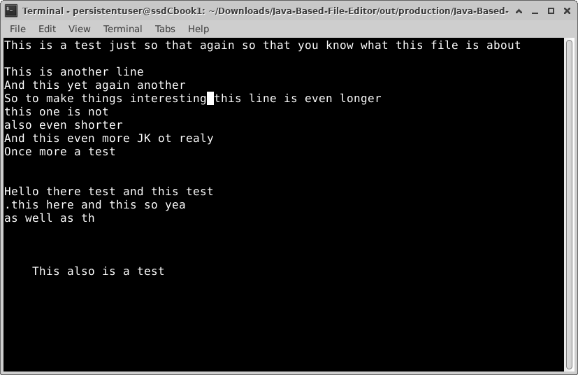

# Java-Based-File-Editor
A command line file editor built entirely in Java



To open the default file (./Directory/exampleFile4.txt):
```
java Main
```
To open any file:
```
java Main "<file_path_here>"
```
